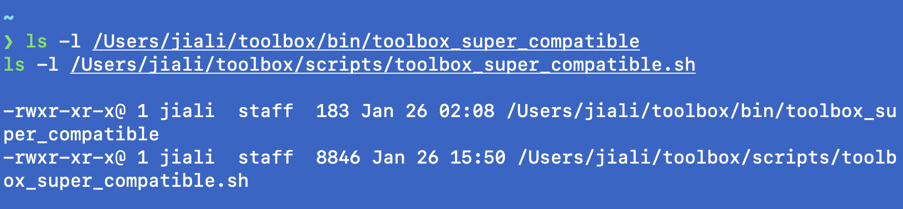
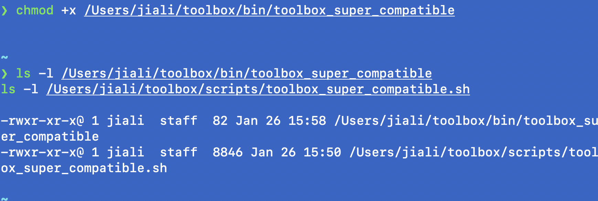

# 2026-01-26 path drift bin/scripts路径不统一
Tags: #toolbox  #wrapper #path-drift #git

## Symptom
- 增加了toolbox_super_compatible新内容后，再运行，没有预期的效果

## Impact
- 我以为是脚本没有执行，重新加载 chmod +x，再运行，出现预期效果
- 我不确定是不是真的解决了问题
    1. 碰巧解决了，但根本原因没有解决
    2. 根本原因仍在，我还没有解决

## Root cause
- 事实（observed）：type -a / ls -l 显示实际执行路径在 bin/...，且时间戳/内容与scripts/...不一致
- 机制（mechanism）：wrappers是复制品/旧版本，导致入口与真源漂移

## Evidence
- CMD `ls -l /Users/jiali/toolbox/bin/toolbox_super_compatible`
- CMD `ls -l /Users/jiali/toolbox/scripts/toolbox_super_compatible.sh`
- CMD `type -a toolbox_super_compatible`
- IMG 2026-01-26_path-drift_bin-vs-scripts_1.png

- IMG 2026-01-26_path-drift_bin-vs-scripts_2.png



## Fix
- Create wrapper
```
#!/usr/bin/env bash

exec "$HOME/toolbox/scripts/toolbox_super_compatible.sh" "$@"
```

## Prevention
- Single source of truth: bin/ 永远只 exec scripts/...，禁止复制脚本内容
- Verification ritual: 每次改入口跑 type -a toolbox_super_compatible 确认执行路径
- Wrapper generation policy: 只允许一种生成方式：利用create wrapper生成，禁止手工复制