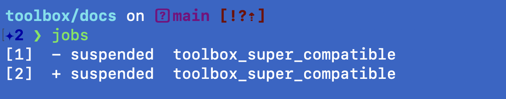
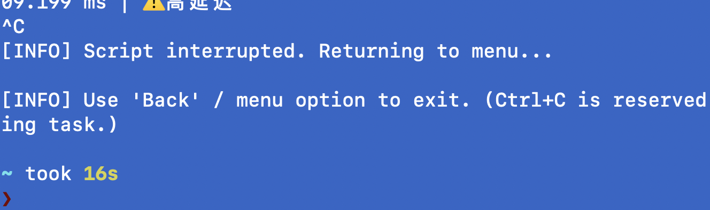

# 故障速查表（Toolbox / macOS / Shell）
# 交互输入（拖拽路径/确认/选择）→ 只读 /dev/tty
# 可被管道消费的输出（结果、路径）→ 写 stdout
# set -u 环境下：所有参数一律用 ${n-}，所有变量一律 {VAR:-default}

## T1 | macOS 上 `rm -r/-rf` 删不掉目录（路径/权限都正确）


**现象**

* `pwd` 正确在 `~/toolbox`
* `ls -ld target` 显示你是 owner 且有写权限
* 但 `rm -r` / `rm -rf` 仍失败

**判定（优先怀疑）**：目录或内部文件带 **immutable flag（uchg/schg）**，权限再对也删不动

**定位**

```bash
ls -ldO scripts/media/Lyrics
# 看输出中是否出现 uchg / schg
```

**修复（唯一正确解）**

```bash
sudo chflags -R nouchg scripts/media/Lyrics
rm -rf scripts/media/Lyrics
```

**预防**

* 同步/备份/脚本可能会把 flag 带过来；遇到“rm 核按钮也无效”，直接跳到 `ls -ldO`

---

## T2 | macOS 的 `/bin/rm` 不支持 `--help`（“illegal option -- -”）
#macos #system


**现象**

```bash
rm --help | head
# rm: illegal option -- -
```

**判定**：你用的是 **BSD rm（macOS 自带 /bin/rm）**，不支持 GNU 风格长参数 `--help`

**正确做法**

```bash
man rm
rm -h   # 有些工具支持 -h；rm 通常用 man
```

**补充**

* 这也顺带证明：你看到的 `rm [-pv]` 不是系统 rm 的语法，而多半来自某个脚本/usage 文本

---

## T3 | 终端里出现“引号/符号怪异”，脚本变量多了中文引号导致逻辑异常
#input

**现象**

* 数值或字符串输出里出现 `“80”` 这种中文引号
* 同样脚本在另一台机器正常，这台不正常
* grep/比较/数值判断莫名失败

**判定**：输入法导致你写进去了 **中文全角引号**（`“ ”`）而不是 ASCII `"`

**定位（快速肉眼）**

* 看起来像引号，但宽一点、弯一点：基本就是全角

**修复**

* 把 `“ ”` 全部替换成 `"`（ASCII）
* 推荐用编辑器全局替换，或命令行（谨慎对路径）

```bash
# 示例：只给你思路，执行前先备份/确认文件
grep -n '“\|”' -R scripts
```

**预防**

* 写脚本时强制英文输入法
* 关键输出统一用 `printf '%q\n' "$var"` 做可见化（调试期）

---

## T4 | fzf 场景里 `read -r` 读输入不稳定（或 Ctrl+C 行为怪）
#fzf

**现象**

* 选择菜单后提示输入参数，`read -r` 偶尔读不到/卡住/被 fzf/管道影响
* Ctrl+C 影响主程序稳定性

**判定**：fzf/管道/子 shell 场景下 stdin 不可靠，需要从 **/dev/tty** 直接读

**正确模式（你现在用的就是对的）**

```bash
read_tty() {
  local prompt="$1"
  local out=""
  printf "%s" "$prompt" >/dev/tty
  IFS= read -r out </dev/tty || true
  printf "%s" "$out"
}
```

**预防**

* 任何“菜单 + 输入”组合，都优先 `read_tty`

---

## T5 | 扁平化菜单后，脚本路径/Wrapper 路径容易漂移（尤其目录结构变更）
#wrapper


**现象**

* 菜单能选到脚本，但执行时报“找不到文件”
* wrapper 指向旧目录，移动 scripts 目录结构后 wrapper 全失效

**判定**

* wrapper 写死了绝对路径，或相对路径计算不稳
* 扁平化扫描拿到的是 `REL`，但执行时拼路径有边界 bug

**稳健策略（你当前方案正确）**

* **执行**：统一 `REL + DIR + FILE`，并在 run_cmd 里打印 `[RUN] REL -> fullpath/file`
* **wrapper**：尽量写成相对 `$SCRIPTS_DIR` 的路径，而不是绝对路径

**可选增强（建议写进代码注释）**

* wrapper 内容固定：

```bash
SCRIPTS_DIR="${SCRIPTS_DIR:-$HOME/toolbox/scripts}"
exec "$SCRIPTS_DIR/<rel_dir>/<file>" "$@"
```

---

## T6 | Ctrl+C 需求：只中断子脚本，不退出 toolbox 主程序
#interact#ctrlc

**现象**

* Ctrl+C 想停止当前脚本，但不要把主菜单也杀掉

**判定**

* 需要把信号处理隔离在子 shell，主循环忽略 INT

**标准做法（你现在 run_cmd 结构是对的）**

* 主循环：

```bash
trap '' INT
```

* 运行子任务用子 shell，并在子 shell 内 trap INT：

```bash
(
  trap 'echo; echo "[INFO] Script interrupted. Returning to menu..."; exit 130' INT
  bash "$script" "$@"
)
```

* 返回后根据 exit code 打印结果（0/130/其他）

---

## T7 | rsync dry-run 也会“读盘”吗？（SSD data_read 统计困惑）
#rsync#dry-run#fzf

**现象**

* 你连续跑 rsync（包括 dry-run），发现 SSD `data_read` 仍增长
* dry-run 体积很小时可能看不出来变化

**判定（经验结论）**

* dry-run 不写入目标，但仍可能需要**枚举文件、读元数据**，某些情况下也会读更多（比如需要扫描大量目录/文件列表）
* 是否大量读盘，取决于：文件数、目录深度、是否需要比对属性、是否启用 checksum 等

**实用建议**

* 用“文件数量/路径变化”来判断 dry-run 的真实成本，不要只看本次拷贝字节
* 你已经确认“没有 checksum”，所以读盘成本通常主要来自目录遍历/元数据比对

---

## T8 | `eject /dev/diskX` 报错（用错命令/对象）
#tools
**现象**

* 你在 macOS 上执行类似：

  ```bash
  eject /dev/disk5
  ```

  报错或不生效

**判定**

* macOS 常用卸载/弹出命令是 `diskutil`（不是 Linux 的 eject 习惯）
* 需要区分：

  * **卸载 volume**（unmount）
  * **弹出磁盘**（eject）

**定位**

```bash
diskutil list
diskutil info /dev/disk5
```

**修复**

* 卸载该盘所有卷：

```bash
diskutil unmountDisk /dev/disk5
```

* 弹出（断开）该盘：

```bash
diskutil eject /dev/disk5
```

**预防**

* 记住：macOS 上“磁盘相关”优先 `diskutil`

---

## T9 | “filtered files” 是什么意思（rsync 输出理解）
#rsync
**现象**

* rsync 输出里出现 `filtered files`，你不确定含义

**判定**

* 被 rsync **排除/过滤** 的文件数量（通常来自 `--exclude`、`--filter`、`.rsync-filter` 或默认规则）
* 也可能是你脚本里设置了排除项（常见：`.DS_Store`、缓存、临时文件、node_modules 等）

**定位**

* 看你运行命令里是否有：

  * `--exclude=...`
  * `--filter=...`
  * `--exclude-from=...`
* 或检查目录里是否有 `.rsync-filter`

**修复**

* 想让它不被过滤：移除对应 exclude/filter 规则
* 想确认“到底过滤了哪些”：加上 itemize/verbose（根据你的脚本可选）

```bash
rsync -avn --itemize-changes ...
```

**预防**

* 备份脚本里明确把 exclude/filter 写到注释中，避免“黑箱过滤”

---

## T10 | 三级菜单→扁平化后，“边界”导致路径拼接错
#structure
**现象**

* 菜单能选中脚本，但执行报：

  * 找不到文件
  * 或执行到错误路径
* 你后来通过对比 debug 输出定位到了“边界问题”

**判定**

* 典型错误点：`DIR="."`、`dirname` / `basename` 在根目录时处理不一致
* 以及 `SCRIPTS_DIR` 与 `fullpath` 是否包含尾部 `/` 的细节

**定位（你现在已有）**

```bash
echo "[DBG] REL=$REL DIR=$DIR FILE=$FILE" >/dev/tty
```

**修复（稳健规则）**

* `REL` 永远是相对 `SCRIPTS_DIR` 的路径
* `DIR` 统一归一化：

  * `.` → `$SCRIPTS_DIR`
  * 其他 → `$SCRIPTS_DIR/$DIR`

**预防**

* 所有执行入口只接受：`REL + fullpath + filename + args`
* 禁止在多处重复拼路径（减少边界 bug）

---

## T11 | wrapper 白名单/命名不一致导致“旧 wrapper 干扰”
#wrapper
**现象**

* 你提到“白名单不一致/需要删旧 wrappers 吗？”
* 新结构上线后，旧 wrapper 仍在 PATH，行为不符合预期

**判定**

* wrapper 是**稳定入口**，但也会成为“陈旧指针”
* PATH 顺序导致你调用到旧 wrapper（尤其同名时）

**定位**

```bash
command -v <wrapper_name>
which -a <wrapper_name>
ls -l "$HOME/toolbox/bin/<wrapper_name>"
```

**修复**

* 批量找出 bin 目录里指向旧路径的 wrapper：

```bash
grep -R "toolbox/scripts" "$HOME/toolbox/bin"
```

* 删除或重建（你 toolbox 里已有 delete_wrapper/create_wrapper）

**预防**

* wrapper 内容尽量使用 `$SCRIPTS_DIR` 相对路径，而不是绝对路径
* wrapper 文件头部注释写清 target（你已做到）

---

## T12 | macOS 手势/快捷键与 Windows/VM 映射混乱（“Command+R 变 Spotlight”）
#system
**现象**

* 同一套键位在 iMac/VMware/Windows 里行为不同
* 你遇到：

  * `Command+R` 在某环境触发 Spotlight
  * 删除键不符合预期

**判定**

* 这是“宿主机 macOS + 虚拟机 Windows + 键盘映射层”的叠加结果
* VMware 可能把部分组合键拦截/映射为系统快捷键

**定位**

* VMware 设置里找：

  * Keyboard shortcuts / Key mapping
  * 是否启用 “Send shortcuts to virtual machine”

**修复（原则）**

* 在 VM 里用 Windows 语义的删除：`Del` / `Fn+Delete`（按你的键盘型号）
* 对关键组合键，优先设置 VMware：把快捷键“发送到虚拟机”

**预防**

* 形成两套 muscle memory：macOS / Windows（VM 内）
* 常用操作用 UI 路径兜底（文件菜单等），避免组合键陷阱

---

## T13 | zsh 插件：补全/高亮/建议（“三个必要插件”）
#zsh 
**现象**

* 你要“高亮、自动补全、历史建议”三件套

**判定**

* zsh 生态里最常见的稳定组合：

  * `zsh-autosuggestions`
  * `zsh-syntax-highlighting`
  * `fast-syntax-highlighting`（可替代上一条）
  * 再加一个补全增强：`zsh-completions`（可选）

**修复（最小可运行）**

* 如果你用 Homebrew：

  * 安装后在 `.zshrc` 按顺序加载（高亮通常要放后面）
* 你之前已经在推进这块，我建议你在速查表里只保留**“插件名 + 加载顺序”**，避免写太长

**预防**

* 插件加载顺序出错会导致“补全/高亮消失”，这是最常见问题


## T14 | 成过程
#interact#ctrlc

**Created**: 2026-01-28 02:37

**A. 触发（Friction）**
- 边界-摩擦-生成-新秩序

**B. 证据（Evidence）**
```bash
# paste commands + outputs
```

**C. 判定（Diagnosis）**
- 

**D. 修复（Fix）**
```bash
# paste fix commands
```

**E. 回归测试（Verify）**
```bash
# how to confirm it's resolved
```

**F. 预防（Prevention）**
- 

## T15 | test: how to use opesearch_troubleshootig.sh
#interact

**Created**: 2026-01-28 09:04

**A. 触发（Friction）**
- help_new_case first

**B. 证据（Evidence）**
```bash
# paste commands + outputs
```

**C. 判定（Diagnosis）**
- 

**D. 修复（Fix）**
```bash
# paste fix commands
```

**E. 回归测试（Verify）**
```bash
# how to confirm it's resolved
```

**F. 预防（Prevention）**
- 

## T16 | zsh出现suspended job数量提示
#zsh

**Created**: 2026-01-28 13:16

**A. 触发（Friction）**
- 提示符左侧出现数字，比如2
- ctrl z

**B. 证据（Evidence）**
```bash
# paste commands + outputs
```

**C. 判定（Diagnosis）**
- ctrl z触发

**D. 修复（Fix）**
```bash
# paste fix commands
```
- jobs / kill 
- exit
**E. 回归测试（Verify）**
```bash
# how to confirm it's resolved
```
- 提示符旁边的数字消失
**F. 预防（Prevention）**
- trap ''TSTP

## T17 | toolbox:Ctrl+C后主程序被杀掉/不能“返回菜单”(set -e +130)
#interact #ctrlc #bash #zsh #set_e #trap

**Created**: 2026-01-28 14:44

**A. 触发（Friction）**
- 在toolbox里运行子脚本按ctrl c
- 预期：只中断子脚本，回到菜单
- 实际：toolbox主程序也直接退出（回到shell）或流程断掉

**B. 证据（Evidence）**
```bash
# paste commands + outputs
```


**C. 判定（Diagnosis）**
- 1. 看主脚本是否启用 errexit
`grep -n 'set -.*e' toolbox_supper_compatible.sh

**D. 修复（Fix）**
```bash
# paste fix commands
```

**E. 回归测试（Verify）**
```bash
# how to confirm it's resolved
```

**F. 预防（Prevention）**
- 

## T18 | 截图证据管理导致repo膨胀/手动成本高
#github#screenshot

**Created**: 2026-01-28 16:05

**A. 触发（Friction）**
- 截图落在Desktop，需要手动重命名/复制到assets；assets进git导致体积增长快

**B. 证据（Evidence）**
```bash
# paste commands + outputs
```

**C. 判定（Diagnosis）**
- 证据留存需求与代码仓库侧路未分层（raw与publish未分离）

**D. 修复（Fix）**
```bash
# paste fix commands
```
- 分层：assets/ （压缩/进git） + assets_raw/ （原图，不进git）
- 自动化：提供import_screenshot--一键完成“选择-重命名-压缩-落位”

**E. 回归测试（Verify）**
```bash
# how to confirm it's resolved
```

**F. 预防（Prevention）**
- assets设置体积红线（例如 单图 > 500KB必须压缩；raw永不进git）
- 

## T19 | git push no work(untracked files)
#git#macos#troubleshooting

**Created**: 2026-01-29 01:39

**A. 触发（Friction）**
- git push no work

**B. 证据（Evidence）**
```bash
# paste commands + outputs
```

**C. 判定（Diagnosis）**
- push 只推commit；untracked 没add/commit不会被push

**D. 修复（Fix）**
```bash
# paste fix commands
```


**E. 回归测试（Verify）**
```bash
# how to confirm it's resolved
```

**F. 预防（Prevention）**
- 

## T20 | bump_toolbox_versiochangelog.md文件写空
#git

**Created**: 2026-01-29 17:42

**A. 触发（Friction）**
- 打开changelog.md文件后，文件是空，没有内容，被删除了

**B. 证据（Evidence）**
```bash
# paste commands + outputs
```

**C. 判定（Diagnosis）**
- bump_toolbox_version.sh 里面的 ` mv "$temp" "$CHANGELOG_FILE" `前面没做防护，导致直接写空了旧有的文件

**D. 修复（Fix）**
```bash
# paste fix commands
```
```
# 写入前：如果目标文件原本非空，禁止写成空
# Guard 1: tmp must contain the entry
grep -qF "$ENTRY" "$tmp" || die "Refuse to write: entry not found in tmp (bug)."

# Guard 2: refuse to clobber a non-empty changelog into empty
if [[ -s "$CHANGELOG_FILE" && ! -s "$tmp" ]]; then
  die "Refuse to overwrite non-empty changelog with empty content."
fi
```
## Change
- bump_toolbox_version now auto-opens changelog after update
- add guards to prevent changelog from being overwritten to empty

## Why
- avoid losing release notes due to path mismatch or empty-write bugs

## Risk
- low; only affects changelog writing/open behavior

## Rollback
- revert scripts/system/bump_toolbox_version.sh

## Verification
- run: system_bump_toolbox_version "test"
- ensure: changelog.md non-empty; new entry prepended; TOOLBOX_VERSION updated

## T21 | Shell作业控制（zsh/bash）
#shell#zsh#bash#jobs

**Created**: 2026-01-29 19:57

**A. 触发（Friction）**
  先记住一条铁律
Ctrl-Z 只会暂停“当前前台进程组”（占着终端的那个）。
在 prompt 下按 Ctrl-Z：不会产生 job（jobs 仍为空）。
好，我继续把这份速查表**升级到“现场/生产可用”级别**：加入你以后一定会遇到的边界情形（TTY 输入导致后台停止、SSH 断开、disown/nohup、monitor mode 等），并把格式压缩成你说的那种“翻一眼就能用”。

---

# 故障速查表（增强版）：Job Control / TTY / SSH（zsh/bash）

## A. 一眼判断区（先做这 3 条）

### A1) `jobs` 为空

**判定：** 当前 shell 没有 job（正常）。
**动作：** 无。

### A2) `jobs -l`

```bash
jobs -l
```

**用途：** 同时看到 job号 + PID（后续 fg/bg/kill 都靠它）。

### A3) 谁在占终端？

如果你“像卡住”：

* 先 `Ctrl-C`
* 再 `stty sane`（救命用）
* 再查 `jobs -l`

---

## B. 高发故障 1：后台任务突然变成 “Stopped (tty input)”

### 症状

`jobs` 里看到类似：

* `stopped (tty input)` / `tty output` / `suspended (tty input)`

### 判定（考点）

**后台进程尝试从终端读/写**，shell 为了保护终端，给它停了（典型信号：SIGTTIN / SIGTTOU）。

### 处理（标准）

1. 拉回前台让它交互：

```bash
fg %1
```

2. 或者改成不读 tty（重定向 stdin）再后台跑：

```bash
command </dev/null &
```

3. 需要持续后台写输出就重定向：

```bash
command >out.log 2>&1 &
```

### 验证

```bash
jobs
```

应从 `stopped (tty input)` → `running`

---

## C. 高发故障 2：关闭终端/断开 SSH 后任务没了

### 症状

你退出 terminal / SSH 断线后，后台任务消失。

### 判定

默认情况下，终端会给该会话的作业发送 **SIGHUP**（挂断信号），很多程序会退出。

### 解决套路（按需求选）

#### 方案 1：从一开始就不依赖终端（最稳）

```bash
nohup command >out.log 2>&1 &
```

#### 方案 2：已经在跑了，想让它“脱离当前 shell”

```bash
disown %1
```

（zsh/bash 都支持；disown 后它不再是 job，`jobs` 也不会显示它）

#### 方案 3：临时避免 SIGHUP（不如 disown/nohup 清晰）

```bash
command &
# 然后：
disown
```

---

## D. 高发故障 3：我 `fg` 回来后输入了命令（比如打了 `jobs`），结果又 Ctrl-Z 了

### 现象解释

你在 `fg` 后，前台是 `sleep 100`（或别的程序）。
你打的 `jobs` 其实不会被执行（因为 shell 不在前台），你按 `Ctrl-Z` 只是把前台程序再暂停一次。

### 处理

先回到 prompt（`Ctrl-C` 或让程序结束），再执行命令。

---

## E. 高发故障 4：`bg` 之后我以为“没在跑”

### 判定

后台 job 不占终端，你看起来“啥都没发生”是正常的。

### 动作

```bash
jobs
ps -p <PID>
tail -f out.log   # 如果你做了输出重定向
```

---

## F. 进阶：monitor mode / 为什么脚本里 jobs/bg/fg 不好使

### 症状

在脚本里用 `jobs`/`fg`/`bg` 行为奇怪，或提示不支持。

### 判定

Job control 主要面向**交互式 shell**。非交互脚本默认可能没开启 monitor mode。

### 检查

```bash
set -o | grep monitor
```

### 开启（仅当你明确需要，且知道风险）

```bash
set -m
```

---

## G. “清场”区：我要把环境恢复到干净状态

### G1) 杀掉所有 job（谨慎）

```bash
jobs -p | xargs -r kill
```

### G2) 只干掉某个 job

```bash
jobs -l
kill %1          # kill job
kill <PID>       # 或 kill PID
```

### G3) 终端显示/输入异常的通用复位

```bash
stty sane
reset
```

（`reset` 更重，会重刷终端）

---

# 最小可复制“演练闭环”（60 秒）

```bash
sleep 100
# Ctrl-Z
jobs -l
bg %1
jobs
fg %1
# Ctrl-Z
jobs
kill %1
jobs
```

**期望终态：** 最后 `jobs` 无输出（零作业态）。

---

## 你的 toolbox 速查表格式（更压缩，适合 CLI 翻看）

你可以直接用这套模板写更多条目：

* **症状：** …
  **判定：** …
  **动作：** `命令`
  **验证：** `命令` → 期望输出 …
----

## T22 | unbound variable
#variable

**Created**: 2026-01-30 07:23

**A. 触发（Friction）**
- 例如：std.sh line 9: $2: unbound variable / date: unbound variable

**B. 证据（Evidence）**
```bash
# paste commands + outputs
```

**C. 判定（Diagnosis）**
- set -u 下读取未定义变量/未传参

**D. 修复（Fix）**
```bash
# paste fix commands
```
* 函数参数写法统一：local x="${1-}" / local y="${2-}"
* 变量默认：FOO="${FOO:-}" 或 FOO="${FOO:-default}"
* 不要在“打印 header”阶段引用尚未赋值的变量（header 要放在 args resolve 之后）


**E. 回归测试（Verify）**
```bash
# how to confirm it's resolved
```

**F. 预防（Prevention）**
- 
## T23 read_tty: command not found
#read_tty #ux # std
原因：你以为 read_tty 在 std/ux 里，但实际没被 source 或函数名不同。
修复：
交互输入全部走 _lib/ux.sh，对外暴露固定 API：ux_read_tty / ux_get_default。
脚本里禁止直接调用 read_tty（避免库漂移）。

## T24  Finder 弹窗选择文件后“路径传不进去”
#path #finder #macos
* 原因：你启用了 file picker（可能走了 subshell / stdin 不稳定），而脚本读取是 stdin 导致拿不到键盘输入。
* 修复：
  * 对交互输入强制用 /dev/tty：
    * printf "... " >/dev/tty
    * IFS= read -r x </dev/tty
* Finder 选择器不是必须；你现在这种“open 目录 + 拖拽路径”最稳。

## T25 Unknown mode: :hybrid / ValueError ... ':12'
#hybrid #wrapper
* 原因：wrapper 传参或用户输入带了 : 前缀（常见于你菜单系统的格式化/显示残留）。
* 修复：
  * normalize_mode()：trim → lowercase → 去掉前缀冒号
  * normalize_interval()：trim → 去冒号 → 数字正则校验

## T26 silence detect 报 “No silence detected”
#lyrics
* 原因：音乐背景持续、阈值/持续时间参数不适配。
* 修复路径：
  * 仍然用 hybrid（自动 fallback fixed）
  * 或调参：SILENCE_THRESHOLD（-25dB ~ -40dB SILENCE_DURATION
  * 或直接 fixed 获得稳定分段

## T27 “危险操作要保留在 ⚠️ wrapper”
#wrapper #danger
* 结论：你已确认策略
  * UX wrapper 只负责“提示 + 确认 + 路由”，危险动作（delete sync等）必须在带 ⚠️ 的入口，且 confirm YES 双重确认。
## T28 | 没有及时备份，昨天的一整天的记录没了
#backup #github

**Created**: 2026-01-31 01:50

**A. 触发（Friction）**
- 想搞v2版toolbox，结果搞砸了，v1的功能没有昨天那么完善，v2也没有眉目，一场空！

**B. 证据（Evidence）**
```bash
# paste commands + outputs
```

**C. 判定（Diagnosis）**
- 但是，我的经历不是假的，我不用这些证明！
- 知识是学到我大脑中的，不是纸上的！

**D. 修复（Fix）**
```bash
# paste fix commands
```

**E. 回归测试（Verify）**
```bash
# how to confirm it's resolved
```

**F. 预防（Prevention）**
- 及时备份，所以我开了time machine，每小时备份一次;
- github,不要同步md文件，这些是我私人的东西！
- github只同步 代码，配置(*.env.example)，我私人的东西留在我的电脑上，让时间机器备份；
- 这次经历也算是一种学习，规则没清楚的时候，很容易翻车的！

## T29 | Safety must emerge from structure, not memory.
#safety

**Created**: 2026-01-31 10:16

**A. 触发（Friction）**
- toolbox-v1版暂停开发，不完美，但是好在基础core脚本都在，功能够用，只是上层调用不够完善

- 我决定暂停v1，开始重构架构，开始v2的开发
- 一步一步认真研究，仔细走，慢慢走，不要急！
- 记录，log，规范化！可审计，可回滚！
## T30 | novel_crawler v6.3 — Safety Gates, Unified Output, Danger Ops Extraction
#novel

**Created**: 2026-02-01 01:40

**A. 触发（Friction）**
- update

**B. 证据（Evidence）**
```bash
# paste commands + outputs
```

**C. 判定（Diagnosis）**
- 

**D. 修复（Fix）**
```bash
# paste fix commands
```

**E. 回归测试（Verify）**
```bash
# how to confirm it's resolved
```

**F. 预防（Prevention）**
- 
