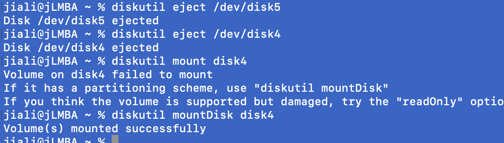
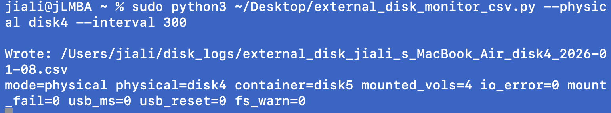
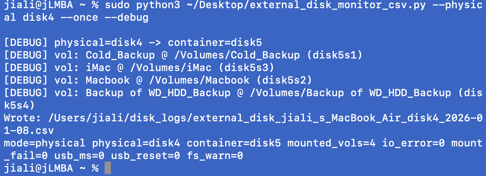
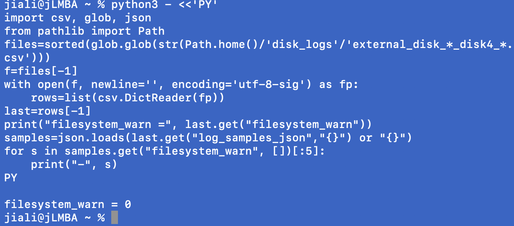
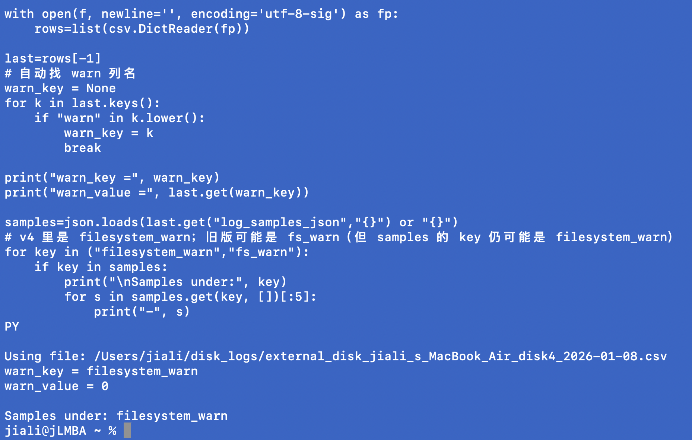
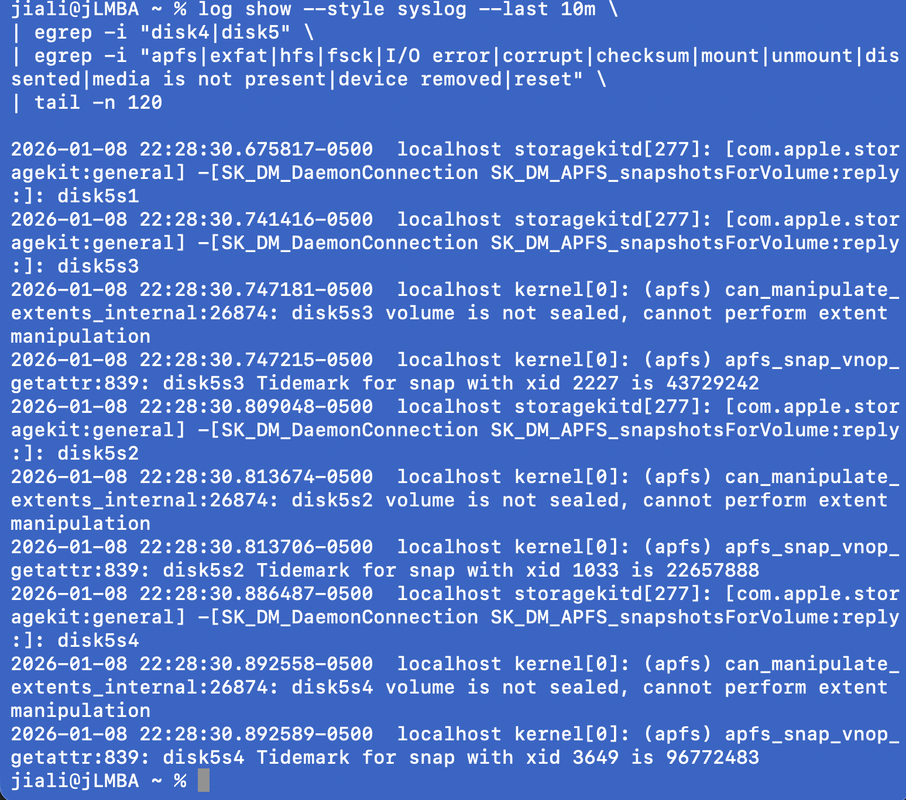
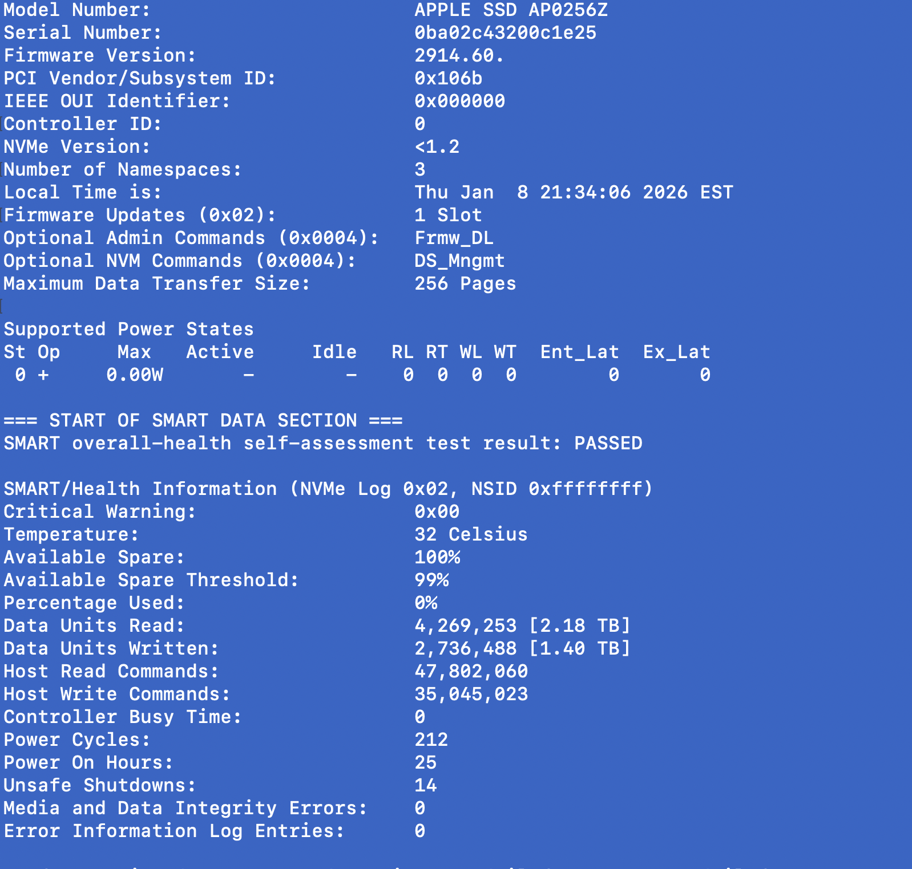
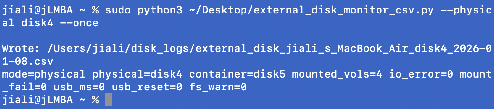

# CMD-建立脚本读取硬盘（内置+外置）（ssd+hdd）数据并导出保存为csv文件日志  
  
  
1. 盘号识别与结构确认（最常用）  
    * 确认外置ssd/hdd是哪一个disk（比如disk4），以及APFS容器（比如disk5）与各个卷（disk5s2/3/4…)  
* # 列出所有磁盘/分区（找 disk4/disk5 这类）  
>     * diskutil list  
*   
* # 只看某块物理盘的分区结构（关键：是否有 APFS Container）  
    * diskutil list disk4  
*   
* # 查看某块盘的详细信息（Mounted / File System / Protocol 等）  
    * diskutil info disk4  
    * diskutil info disk5  
    * diskutil info disk4s2  
    * diskutil info disk5s3  
2. **解释‘为什么disk4显示no file system’**  
* **物理盘disk4不一定直接承载文件系统；如果是APFS,文件系统在synthesized容器（例如disk5）和其他卷（disk5s2/3/4.）**  
**例如：**  
# 你今天看到的典型结构：  
# disk4 (external, physical) -> disk4s2 (Apple_APFS Container disk5)  
# disk5 (synthesized) -> disk5s2 / disk5s3 / disk5s4 (APFS volumes)  
diskutil list disk4  
3. **卷挂载/卸载（finder中看得到但脚本需要确认时）**  
  
* diskutil mountDisk disk4  $挂载整盘 （会尝试挂载该盘下的可挂载卷）  
* diskutil mount disk5s2  
* diskutil mount disk5s3  
* diskutil mount disk5s4 $ 挂载指定卷（slice）  
  
* diskutil eject /dev/disk4 $弹出整块物理盘（安全拔盘）  
  
  
4. **文件系统初始化/格式化（⚠️会清空数据）**  
> **用于新盘/冷备盘：创建GPT + 卷名Cold**  
  
diskutil eraseDisk APFS Cold GPT /dev/disk4 $macOS-only (推荐冷备）：APFS  
  
$跨平台（windows/macOS）：exFAT  
diskutil eraseDisk ExFAT Cold GPT /dev/disk4   
  
5. SMART/健康信息读取（SSD/HDD视硬件而定）  
      5.1	读取JSON  
$读取 smartctl JSON (示例：disk4）  
>  sudo smartctl -a -j /dev/disk4 | head -n 5  
> 
> $ 备注：WD Passport这类usb一体盘经常不透传smart，因为json可能只有基础字段，没有NVMe Log/温度等  
>   
  
  
1.   
  
5.2 对于NVMe SSD(系统盘常见），可以读取到温度/percent used（示例思路）  
> sudo smartctl -a /dev/disk0 | head -n 60  
> 
> sudo smartctl -a -j /dev/disk0 | head -n 40  
  
6. 统一日志（unified log）排障：只抓“磁盘/usb/挂载‘相关  
		随便 grep ‘reset’ 会误抓 wifi/蓝牙/网络等信息，所以要收紧过滤  
  
> # 精准过滤：只看 disk4 / disk5 / USB 大容量存储 / 磁盘仲裁  
> 
> log show --style sys  
>   
> log --last 30m \  
> 
> | egrep -i "disk4|disk5|diskarbitrationd|USBMSC|MassStorage|IOUSBHost|IOMedia|I/O error|mount|unmount|dissented" \  
> 
> | tail -n 200  
  
> 7. 监控脚本运行与验证  
> 
> 7.1	按物理盘监控 （推荐：自动识别container）  
  
> 例子：  

sudo python3 ~/Desktop/external_disk_monitor_csv.py --physical disk4 --interval 300  
  
  
7.2 只跑一次（快速验证）  
sudo python3 ~/Desktop/external_disk_monitor_csv.py --physical disk4 --once  
  
  
7.3 debug: 打印finder可见卷  
  
sudo python3 ~/Desktop/external_disk_monitor_csv.py --physical disk4 --once --debug  
  
  
8 快速查CSV (确认写入&看最后几行）  
  
# 找到最新日志文件（按 disk4）  
ls -lt ~/disk_logs | head  
  
# 看最后几行（每次采样多卷会写多行）  
tail -n 10 ~/disk_logs/external_disk_*_disk4_*.csv  
  
  
9 从csv中抽取fs_warn的样本证据（如需定位噪音/真错误）  
  
> python3 - <<'PY'  
> 
> import csv, glob, json  
> 
> from pathlib import Path  
> 
> files=sorted(glob.glob(str(Path.home()/'disk_logs'/'external_disk_*_disk4_*.csv')))  
> 
> f=files[-1]  
> 
> with open(f, newline='', encoding='utf-8-sig') as fp:  
> 
>     rows=list(csv.DictReader(fp))  
> 
> last=rows[-1]  
> 
> print("filesystem_warn =", last.get("filesystem_warn"))  
> 
> samples=json.loads(last.get("log_samples_json","{}") or "{}")  
> 
> for s in samples.get("filesystem_warn", [])[:5]:  
> 
>     print("-", s)  
> 
> PY  

  
>   
  
> python3 - <<'PY'  
> 
> import csv, glob, json  
> 
> from pathlib import Path  
>   
> files=sorted(glob.glob(str(Path.home()/'disk_logs'/'external_disk_*_disk4_*.csv')))  
> 
> if not files:  
> 
>     files=sorted(glob.glob(str(Path.home()/'disk_logs'/'external_disk_*_*.csv')))  
> 
> f=files[-1]  
> 
> print("Using file:", f)  
>   
> with open(f, newline='', encoding='utf-8-sig') as fp:  
> 
>     rows=list(csv.DictReader(fp))  
>   
> last=rows[-1]  
> 
> # 自动找 warn 列名  
> 
> warn_key = None  
> 
> for k in last.keys():  
> 
>     if "warn" in k.lower():  
> 
>         warn_key = k  
> 
>         break  
>   
> print("warn_key =", warn_key)  
> 
> print("warn_value =", last.get(warn_key))  
>   
> samples=json.loads(last.get("log_samples_json","{}") or "{}")  
> 
> # v4 里是 filesystem_warn；旧版可能是 fs_warn（但 samples 的 key 仍可能是 filesystem_warn）  
> 
> for key in ("filesystem_warn","fs_warn"):  
> 
>     if key in samples:  
> 
>         print("\nSamples under:", key)  
> 
>         for s in samples.get(key, [])[:5]:  
> 
>             print("-", s)  
> 
> PY  
  
  
  
方案 B（更精准：只要“包含 disk4/disk5 的行”，然后再看错误词）  
  
> log show --style syslog --last 10m \  
> 
> | egrep -i "disk4|disk5" \  
> 
> | egrep -i "apfs|exfat|hfs|fsck|I/O error|corrupt|checksum|mount|unmount|dissented|media is not present|device r  
>   
> emoved|reset" \  
> 
> | tail -n 120  

  
  
  
  
[ssd_hdd_monitor_csv](Attachments/0C58F51E-463F-4ED2-8EC5-ED96B5D16706)  
  
  
  
# [Check_ssd_monitor_csv.py](Attachments/E6CFAA8A-47C3-4012-8E0C-78138271CA18.py)  
#   
#   
  
# [外置硬盘_排障与监控_CMD日志.pdf](Attachments/25B7465C-50B7-4B05-8A7C-AE63BE058323.pdf)  
#   
#   
# [ssd_monitor.sh](Attachments/AE50DBE3-606D-43B9-BE90-81F81D8E6847.sh)  
# [ssd_monitor_csv.py](Attachments/CA483921-0518-411A-8B22-FE3A4CE23FDA.py)  
  
  
主题tag：#Mac#Hardware#Disk  
状态：#Fix#Gold  
  
  
